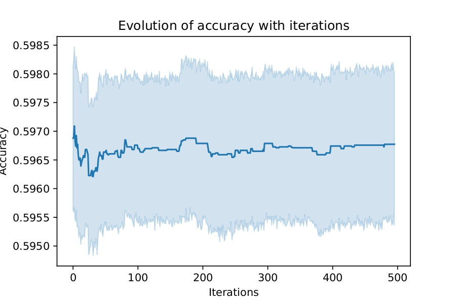
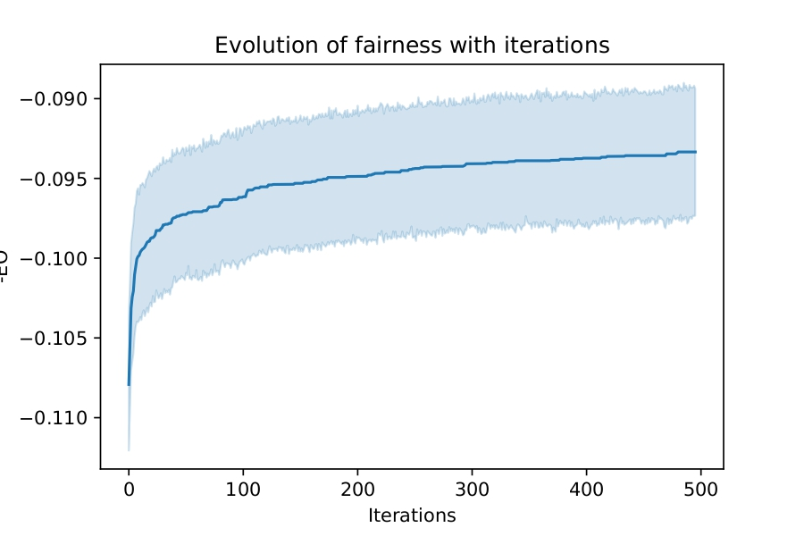
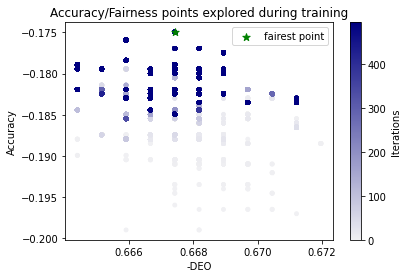
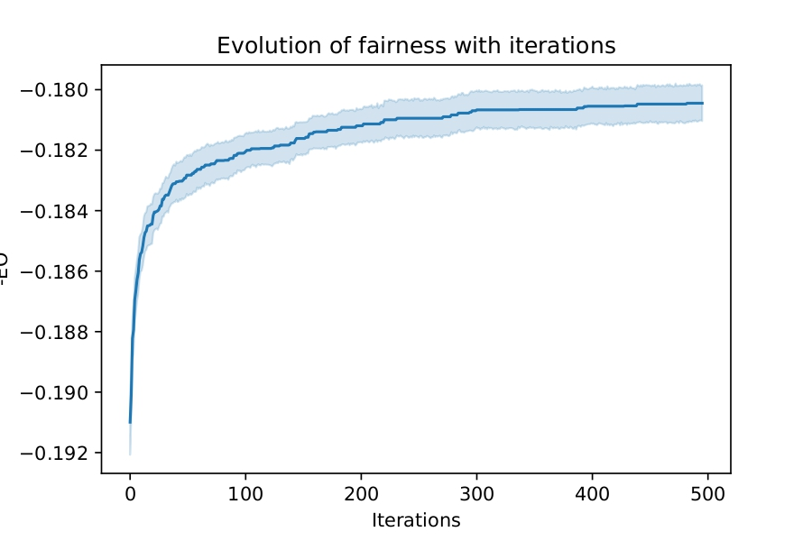
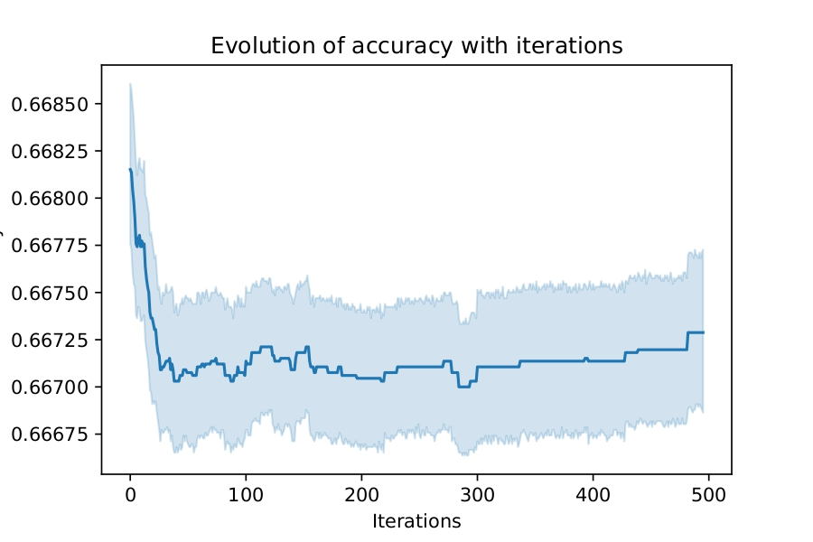

# Fairness-Oriented Black-Box Data Poisoning


## Abstract
Machine learning models deployed in real-world systems often suffer from unfair decision-making across sensitive groups. While fairness-aware training methods exist, they typically assume access to model internals, training pipelines, or retraining authority — assumptions that rarely hold in practice.

This project investigates a different direction: **leveraging black-box data poisoning as a mechanism to improve model fairness**. By carefully injecting a small number of crafted samples into the training data, the deployed model can be nudged toward fairer outcomes **without modifying the model architecture, loss function, or hyperparameters**.

## Project Context
- **Course:** ML701 – Machine Learning  
- **Institution:** Mohamed bin Zayed University of Artificial Intelligence (MBZUAI)  
- **Type:** Individual project  
- **Focus Areas:**  
  - Fairness in Machine Learning  
  - Adversarial Learning  
  - Black-box Optimization  
  - Data Poisoning  

## Motivation
Most fairness interventions assume:
- Access to model gradients or internals
- Ability to change the training process
- Cooperation from the model owner

In contrast, many real systems are:
- Proprietary
- Black-box
- Already deployed

This project demonstrates that **data-level interventions alone** can be sufficient to improve fairness, even when interacting with a third-party learner that cannot be modified.

## Problem Formulation
The task is formulated as a **bi-level optimization problem**:

```

argmin_h g(w*, h)  subject to  w* ∈ argmin_w f(w, h)

```

Where:
- `h` represents the poisoning configuration (synthetic data points)
- `w` denotes model parameters learned by the black-box algorithm
- `f(w, h)` is the standard training objective of the learner
- `g(w*, h)` measures post-training fairness

The outer objective seeks poisoning strategies that optimize fairness, while the inner objective simulates a realistic training pipeline used by an external party.

## Optimization Approach

### Outer Optimization (Poisoning Strategy)
- **Bayesian Optimization** is used to search the poisoning space efficiently
- Well-suited for:
  - Expensive objective evaluations
  - Low-budget optimization
  - Black-box objectives

### Inner Optimization (Target Model Training)
The inner loop assumes **no access** to training internals and relies on default configurations.

Supported classifiers:
- **Random Forest**
- **Gradient Boosting**

These models are chosen to reflect commonly deployed, non-differentiable learning systems.

## Fairness Evaluation
Fairness is evaluated after training using group-based metrics.  
The poisoning objective balances:
- Maintaining predictive performance
- Reducing disparity across sensitive groups

Exact metrics and experimental details are available in the accompanying notebooks.

## Repository Structure
```

.
├── Bayesian_Optimization/
│   ├── core optimization logic
│   ├── experiment runners
│   └── configuration files
│
├── Gradient_based Fairness/
│   ├── gradient-driven poisoning experiments
│   └── comparative analysis
│
├── notebooks/
│   ├── dataset exploration
│   ├── fairness metric visualization
│   └── result interpretation
│
└── images/
└── plots and figures used in this README

```

## Experimental Results

### Random Forest Classifier





Results show a consistent shift toward fairer decision boundaries with minimal performance degradation.

### Gradient Boosting Classifier





Similar fairness improvements are observed, demonstrating that the approach generalizes across model families.

## Key Takeaways
- Fairness improvements are possible **without access to model internals**
- Bayesian Optimization is effective for low-budget poisoning strategies
- Data poisoning can be **constructive**, not only adversarial
- The method generalizes across multiple black-box classifiers

## Limitations
- Computational cost increases with poisoning budget
- Fairness gains depend on dataset characteristics
- Designed for research and academic evaluation, not deployment

## Ethical Considerations
Although data poisoning is traditionally associated with malicious attacks, this work explores its **ethical and defensive potential**. All experiments were conducted in controlled academic settings for research purposes only.

## Citation
If you use or reference this work, please cite it as an academic project conducted at MBZUAI.

---
